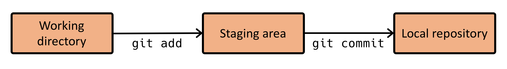
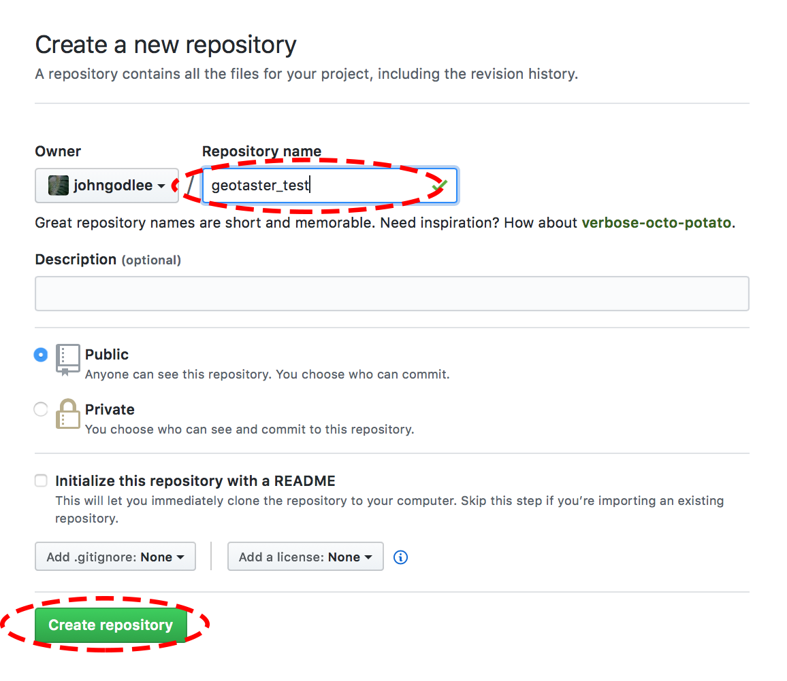
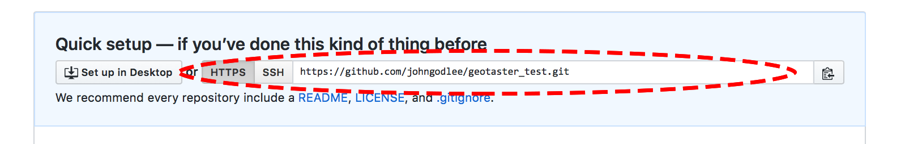
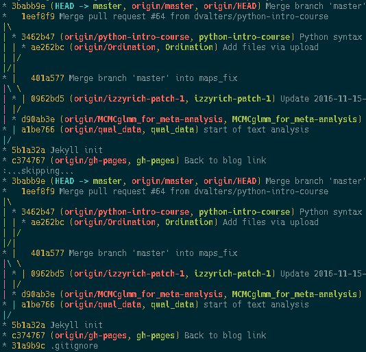
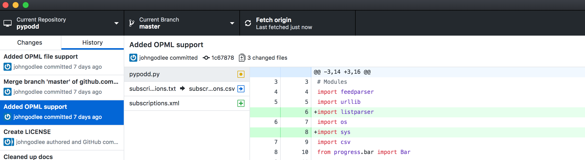
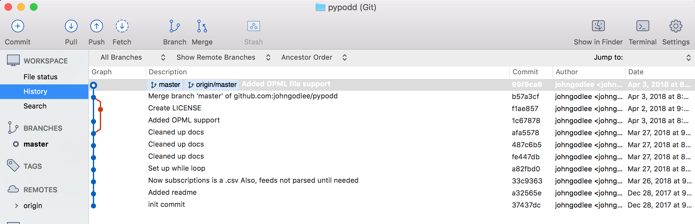
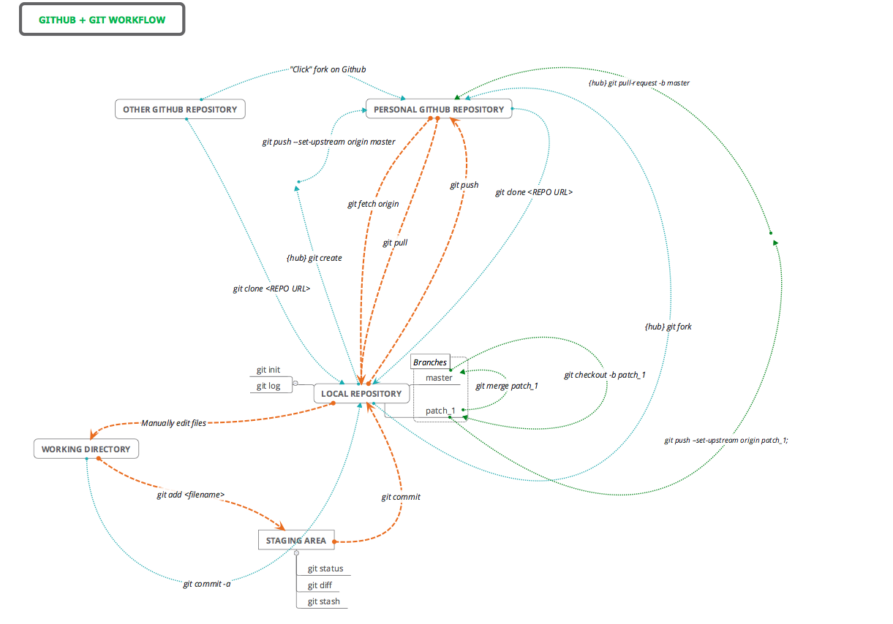
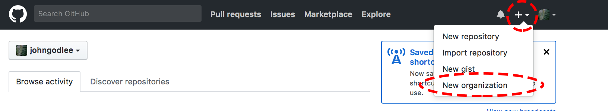

# Introduction to Version Control with Git

## Aims

### <a href="#section1"> 1. Understand version control</a>

### <a href="#section2"> 2. Setup Git</a>

### <a href="#section3"> 3. Learn a basic Git workflow</a>

### <a href="#section4"> 4. Setup Github</a>

### <a href="#section5"> 5. Explore the commit history</a>

### <a href="#section6"> 6. Learn to use multiple branches, merging, pull requests, forks</a>

### <a href="#section7"> 7. Explore the many Git GUIs</a>

### <a href="#section8"> 8. Explore extra services built around Github</a>

### <a href="#section9"> 9. Learn more advanced Git commands</a>

### <a href="#section10"> 10. Configure the `.gitconfig` file</a>

### <a href="#section11"> 11. Getting the most out of Github as an academic</a>

This workshop will teach you about the basics of using the Git version control software. In particular it will focus on how it can be used to enrich your academic research, making collaborating with other researchers more efficient and organised. This workshop isn't a definitive guide to Git, it merely serves as an introduction. If you want to pursue the topic further, follow the resources found at the end of this page.

<a name="section1"></a>

## 1. Understand version control


Version control systems are a way of recording the changes made to a file or directory of files over time. This allows you to easily recall specific past versions of your files, and helps to keep track of how a file has changed over time. There are a few version control software packages out there, which range drastically in their complexity. The other notable contender to Git, which shares many similarities, is called [Subversion](https://subversion.apache.org) (SVN). 


Version control softwares like Git are especially useful for writing computer code. If a change you have made breaks the code, you can easily compare the code with a previous working version to find out what the problem is. You can then either revert completely to the previous version, or amend the current code to fix the problem. However, version control software can be used effectively with any plain text file. This means you could use it when writing prose as a `.tex` document, `.txt` or `.md` notes, `.csv` data files etc. In fact, Git can (technically) be used with any type of file, including binary files like `.docx` or `.png`, though comparing versions of these files is more difficult. 

You may be implementing some sort of _ad hoc_ version control system in your work already. For instance, you might have a directory full of files called `Dissertation_script_25thFeb.R`, `Dissertation_script_26thFeb.R`, `Diss_Final_FINAL_URGHHH.R`, etc.. While this approach might work for a little while, it will inevitably lead to a directory full of tens or hundreds of files with inconsistent names and subtle differences between them, which makes it difficult to compare versions and might lead to confusion.

Another way that version control software can help is by streamlining the way you collaborate with others on a piece of work. For instance, say you are writing an article for peer review with a colleague, you may choose to edit the article manuscript by passing it back and forth between the authors via email, with each author adding changes and comments as they go. This works fine most of the time, but what if you both want to work on the file at the same time? This might result in some sort of conflict when you want to collate the changes back into a single document. For instance, consider this sentence: 

```
Many aspects of climate influence and control the distribution of vegetation and plant species.
```

Imagine that author "A" makes the following change to the original sentence:

```
Many aspects of climate influence and control the spatial distribution vegetation biomass.
```

But at the same time, author "B" makes this change to the original statement:

```
Many aspects of climate influence the spatial distribution of plant taxa.
```

It is unclear which of these changes is the right one, and which should be discarded. For the author that gets the job of merging all the changes back into the final version of the manuscript, this can be a major headache, and it gets much more complicated than the example above. Version control software can help to highlight these conflicts within the document, making them much easier to solve.

Version control software offers a handy framework within which you can create backup versions of your files to a remote server, meaning you will minimise the risk of losing work if your local computer breaks. 


Given the above use cases for Git, namely recording versions, collaborating with others, and making backups, it's easy to see how version control software would be useful in academic research, especially with the current emphasis on making our work reproducible and repeatable. With version control software it's easy to make every step of the analytical process transparent, so others can look at your code and how it changed over time, so they can repeat your analyses.

<a name="section2"></a>

## 2. Setup Git 

You can follow along through this workshop on a School of GeoSciences Windows machine, a School of GeoSciences remote Linux session, or a personal laptop running Windows, macOS or Linux. Once you are set up with Git using one of the methods below, everything else in the workshop will be identical across the different operating systems ... I hope.

### Setup Git on a personal Windows machine

Head to [https://git-scm.com/download/win](https://git-scm.com/download/win). Git should start downloading automatically, otherwise, choose the version which is appropriate for your system. Most systems will need the "64-bit Git for Windows Setup".

Run the installer that just downloaded. The following options are what I would recommend, but feel free to change them to your liking:

1. For "Select Components", check:
	* "Git Bash Here"
	* "Git GUI Here"
	* "Git LFS (Large File Support)"
	* "Associate .git* ..."
	* "Associate .sh ...

2. When prompted to choose the default editor, pick an editor that you know how to use: 
	* "Nano" is a command line editor that is simple to use for beginners.
	* "Vim" is a more advanced command line editor that may be confusing for beginners, but is very powerful. 
	* "Notepadd++" is a simple GUI editor that should be familiar to most.

3. For "Adjust your PATH environment", select:
	* "Use Git from Git Bash only"

4. For "Choose HTTPS transport backend", select:
	* "Use the OpenSSL library"

5. For "Configure the line ending conversions", select:
	* "Checkout Windows-style,..."

6. For "Configure the terminal emulator ...", select:
	* "Use MinTTY ..."

7. For "Configure extra options", select:
	* "Enable file system caching"
	* "Enable Git Credential Manager"


### Setup Git on a personal macOS machine

The easiest way to get Git running on macOS is through Homebrew. Homebrew is a package manager for the macOS command line.

Install Homebrew by opening a `Terminal.app` window and typing:

```shell
/usr/bin/ruby -e "$(curl -fsSL https://raw.githubusercontent.com/Homebrew/install/master/install)"
```

Then install Git by entering:

```shell
brew install git
```

You can then use Git commands from the terminal by typing `git` followed by the command, from any directory.


### Setup Git on a personal Linux machine 

Most Linux distributions will already have a version of Git installed as standard. Otherwise, you can use your package manager to install it by opening a terminal window and typing something like: `sudo apt-get install git` (Ubuntu, Debian), or `pacman -S git` (Arch).


### Setup Git on a GeoSciences Windows machine

Git Bash is already installed on the GeoSciences Windows machines. To run it, simply click it in the Start menu Programs list. This should open a window which behaves like a UNIX terminal window, running the Bash Shell.


### Setup Git in a GeoSciences remote Linux session

Git is already installed on `burn`, the GeoSciences Linux server. Simply login to a `burn` session using whatever method you normally use, then run Git commands from the terminal by typing `git` followed by a command, from any directory.  

<a name="section3"></a>

## 3. Learn a basic Git workflow  

Now that Git is installed, you can create your first Git repository. A repository is simply the name given to a directory that is being tracked by Git. For this workshop we will create a new directory with some example files in it, but you can follow along with an existing directory of your own if you like.

First navigate to the `home` folder in the terminal like this:

```shell
cd ~
```

Then create a new directory:

```shell
mkdir gt_git
```

then dive inside that directory:

```shell
cd gt_git
```

Now for the first Git commit. Initiate the directory as a Git repository (repo) by typing:

```shell
git init
```

If you type `ls -A` to show the files, you will now see a subdirectory called `.git`. This subdirectory contains all the information used by Git to keep track of file changes in this repo. If you delete `.git`, the directory will cease to be a Git repo.

Git keeps track of your files through versions of the repository called "commits". A commit is a snapshot of the repository at a particular point in time.

In order to see how commits work, first create a file called `notes.txt`:

```shell 
touch notes.txt
```

Now if you type:

```shell
git status
```

you will see that Git has noticed that you have added a file, but you have not yet told Git to track the file. This means that currently, any commits you make will not include `notes.txt`.

To add the file so Git tracks it, type:

```shell
git add notes.txt
```

Now if you type `git status` again, you will see that `notes.txt` is now recognised as a new file, a change to the repo that is ready to be included in the next commit.

To create a commit and take a snapshot of the repo, type:

```shell
git commit
```

This will trigger a text editor to open where you can write a short message describing what has changed in this commit. In this instance I might write something like `Created notes.txt, empty`. Then save and exit the editor and the commit will be processed. This commit is now a snapshot that you can return to at any time in the future.

Add a few more commits by changing the contents of `notes.txt` and adding creating some files called `example.txt` and `example.sh`. Fill example.txt with whatever you like, and fill `example.sh` with the following:

```shell
#!/bin/bash

echo "hello world"
```

To view the commits you have made, type the following to get a short description of each commit along with the commit messages that you entered earlier:

```shell 
git log
```

You can type `q` to quit Git log.

This brief example demonstrates the essence of a Git workflow, where you can think of the Git repo broken down into three parts. There is the "working directory", the area where files can be worked on before they are committed. There is also the "staging area" which is where files go once you run `git add`, this is like a preparation area where amended files go before they are committed. Then finally there is the "local repository", which is where finalised file changes go when you run `git commit`.  




Before we get onto more complicated git commands, we need to setup a remote server which will be used to sync versions of the repo, creating a kind of backup.

<a name="section4"></a>

## 4. Setup Github 

In order to demonstrate how to back up Git repositories to a remote server and all the advantages that brings, we will be using [Github](https://github.com) as our remote server host. There are many other Git compatible hosting services, such as [BitBucket](https://bitbucket.org), [GitLab](https://about.gitlab.com) and [Codebase](https://www.codebasehq.com), but Github is the most widely used, so we will stick to that for this demo.

Head to [Github](https://github.com) to get started. You should see a registration form on the front page. Pick a username, an email address and password, then sign up. You will then be sent a verification email to complete the registration process.

Once you are registered, head back to [Github](https://github.com) and sign in. Then go to your profile by clicking the dropdown on the right side of the page and clicking "Your profile", as in the image below.


You should then be able to click "Repositories" and the big green "New" button to create a repository to which we will back up the local Git repository we created earlier. Give the repository the same name as the local repository, which in this case is `gt_git` and click "Create repository".  



Now you will be able to find the link to the newly created respository, either as an SSH link or an HTTPS link. HTTPS links are more likely to work across all platforms, so copy that link.



Then on the command line, navigate to your `gt_git` directory and type the following, replacing `<HTTPS_LINK>` with the link you just copied:

```shell
git remote add origin <HTTPS_LINK>
```

This will connect the remote repository on Github to the local repository.

Next, you can sync the master branch (the only branch for now) of the remote repository with the master branch of the local repository by typing:

```shell
git push -u origin master
```

This will backup any committed files in the local repository to the remote repository.

If you want to back up more commits, you can just type:

```shell
git push
```

You don't need to add `-u origin master` after the first time.

Now if you head back to Github, you should see that the `gt_git` repository now contains the files that were in the local repository.


Make a few more inconsequential commits to the `gt_git` repo on your local machine.

It's good practice to always `git pull` changes from the remote server before you `git push` local changes to the remote server. This will ensure that if any collaborators have committed changes to the repository since you last pulled, that there will be no conflicts. I'll say it again, the mantra should be "Commit, Pull, Push"!


<a name="section5"></a>

## 5. Explore the commit history

Now we have made a few commits, pulled and then pushed, we can start to see how the Git log is growing. The Git log contains a potted history of all the commits in a repository, complete with the commit messages you wrote earlier on to describe the contents of the commit. To view the Git log, type:

```shell
git log
```

You should see something similar to this:


```shell
commit 99f9ca68788a2344b639bacbd08d0a9b55fa190d (HEAD -> master, origin/master)
Author: johngodlee <johngodlee@gmail.com>
Date:   Tue Apr 3 20:08:23 2018 +0100

    Added OPML file support

commit b57a3cf1cda73e83e8e390647c071d59b0bd939f
Merge: 1c67878 f1ae857
Author: johngodlee <johngodlee@gmail.com>
Date:   Tue Apr 3 20:05:31 2018 +0100

    Merge branch 'master' of github.com:johngodlee/pypodd
```

In this case there are two commits. Let's go through it line by line.

The first line of each commit contains the commit hash (`commit 99f9ca68788a2344b639bacbd08d0a9b55fa190d`), which is a string of numbers and letters which provides a unique identifier for each commit. You can use these commit hashes in more complicated Git commands to point to specific commits

The second line shows the author of that commit, simple enough.

The third line shows the date of the commit, as per the local time of the machine where the commit was made.

The indented line at the bottom contains the commit message written by the user describing the commit.

To see more information on a commit, add flags to the `git log` command, e.g.:

```shell
git log -p -n 2
```

This will show the most recent two commits (`-n 2`), and a breakdown of what has been changed in that commit compared to the previous one (`-p`).

If you want to compare a specific commit to the most recent version of the respository, you can use the following, substituting the commit hash with your own:

```shell
git diff 1c6787895640eedfda3c1399f3e2171e0761e91
```

Similarly you can compare two unique commits by quoting both hashes:

```shell
git diff 1c6787895640eedfda3c1399f3e2171e0761e91 3cb9b0f7057b0e190060dd4d16ed5e3ef5b53086 
```

You can also point to commits by their relative position in the commit history. The following compares the most recent commit and the third most recent commit:

```shell
git diff HEAD~1 HEAD~3
```

If you want to play around with git log commands using a repo that has more commits, merges, branches etc.. Clone a random repo from Github, like [this one, a command line bibliography manager](https://github.com/papis/papis) using the code:

```shell
cd ~

git clone https://github.com/papis/papis.git
```

Git log is really customisable, this one liner will show the git branch network graphically, producing a really nice visual effect:

```shell
git log --all --graph --decorate --oneline --simplify-by-decoration
```



<a name="section6"></a>

## 6. Learn to use multiple branches, merging, pull requests, forks

At the moment, if you were to visualise your git commit history in the `gt_git` repository, it would like this, with a simple linear structure, each circle being a commit:


But Git can actually handle multiple parallel sequences of commits, known as branches:


Here we have three branches. The `master` branch is equivalent to the single branch we were working on earlier, while the `documentation` and `shell_test` branches are extra branches with different versions of the repo on them.

The branch system works really well if you have multiple people working on different facets of the same project in the same Git repo. Working on a separate branch means that one person can make changes that could potentially break whatever another person is working on, without actually impacting the first persons work. The branches can then be merged back together later when work has finished on those aspects of the project.

To create a new branch type:

```shell
git checkout -b shell_test
```

This will create a new branch called `shell_test` and switch you to that branch.

Now, the first thing you should do with your new branch is sync it to the remote Github version of the repo. To do this, type:

```shell
git push --set-upstream remote origin shell_test
```

This will create a new remote branch that the local `shell_test` branch will sync with when you run `git push`.

Make some changes to `example.sh` so that the contents of the file looks like this:

```
#!/bin/bash

echo "hello world"

read -p 'Location, e.g. London, United Kingdom, Hawes: -  ' loc

curl wttr.in/$loc
```

Then create a new file called README.md and fill it with text like this:

```shell
touch README.md

echo "This repo was used in the GeoTaster workshop on Git. \`example.sh\` shows you the weather for a given location" > README.md 
```

Now commit these changes to the `shell_test` branch with:

```shell
git add README.md
git add example.sh

git commit
```

In order to make things interesting, switch back to the `master` branch with:

```shell
git checkout master
```

And make some changes to that version of `example.sh`, like this. Notice how this version hasn't changed, even though the `shell_test` version had a load of changes made to it:

```
#!/bin/bash

echo "hello world"

T='gYw'   # The test text

echo -e "\n                 40m     41m     42m     43m\
     44m     45m     46m     47m";

for FGs in '    m' '   1m' '  30m' '1;30m' '  31m' '1;31m' '  32m' \
           '1;32m' '  33m' '1;33m' '  34m' '1;34m' '  35m' '1;35m' \
           '  36m' '1;36m' '  37m' '1;37m';
  do FG=${FGs// /}
  echo -en " $FGs \033[$FG  $T  "
  for BG in 40m 41m 42m 43m 44m 45m 46m 47m;
    do echo -en "$EINS \033[$FG\033[$BG  $T  \033[0m";
  done
  echo;
done
echo
```

Commit those changes to the `master` branch like so:

```shell
git add example.sh

git commit
```

If you forget which branch you are on or which branches you have available, you can view them by typing `git branch`.

FINALLY, what happens if we try to merge the `shell_test` branch into the `master` branch? Hopefully, if you have followed the instructions, you will find that there is a conflict!!! Specifically that there is a conflict in `example.sh`. Git doesn't know how to deal with changes we made on the `master` branch since we split off the `shell_test` branch, as they would be overwritten by equivalent changes on the `shell_test` branch. To fix this, you will have to manually choose which copy of the code or mixture of the code to keep.

Open the offending `example.sh` file in a text editor and you should see this:

```
#!/bin/bash

echo "hello world"

<<<<<<< HEAD
T='gYw'   # The test text

echo -e "\n                 40m     41m     42m     43m\
     44m     45m     46m     47m";

for FGs in '    m' '   1m' '  30m' '1;30m' '  31m' '1;31m' '  32m' \
           '1;32m' '  33m' '1;33m' '  34m' '1;34m' '  35m' '1;35m' \
           '  36m' '1;36m' '  37m' '1;37m';
  do FG=${FGs// /}
  echo -en " $FGs \033[$FG  $T  "
  for BG in 40m 41m 42m 43m 44m 45m 46m 47m;
    do echo -en "$EINS \033[$FG\033[$BG  $T  \033[0m";
  done
  echo;
done
echo
=======
read -p 'Location, e.g. London, United Kingdom, Hawes: -  ' loc

curl wttr.in/$loc
>>>>>>> shell_test
```

It might look confusing at first, but `example.sh` now merely contains the code from both of the branches. The code between `<<<<<<< HEAD` and `=======` is the code in the `master` branch, i.e. the branch you are merging into. The code between `=======` and `>>>>>>> shell_test` if the code in the `shell_test` branch, i.e. the branch you are merging from. I think the code which queries the weather is cool, so I'll keep that one by deleting the code from the master branch, along with the branch pointers and the `=======`. Then save and quit the text editor, the conflict is now resolved!

Now you can add the changed file and commit it to finish the merge. When you find yourself back on the `master` branch you can check the contents of `example.sh` to see that it has worked using `cat example.sh`

You might also want to push the changes you just made to the Github remote with `git push`. 

Branching and merging can get much more complicated than that, with three way merges and the like, but for now this workflow will solve 90% of your branching issues.


<a name="section7"></a>

## 7. Explore the many Git GUIs

Up to now we have done everything in the command line. But there are also many GUI interfaces for Git. Some notable ones include:

Github Desktop



Sourcetree



GitKraken


All of them follow similar designs, and you could argue they make simple Git operations easier, such as visualising branch relationships. On the other hand, it is impossible to perform some of the more complex Git operations using these GUIs, and I maintain that once you get to learn the Git command line interface you will be much more efficient and quick than if you used a GUI.

For now we will stick with the command line, this is just to let you know that GUI options do exist and you can explore them in your own time if you like.


<a name="section8"></a>

## 8. Explore extra services built around Github 

The Github ecosystem encompasses more than just the basic remote repository server. Github has additional services and integrations that may be very useful for academic research. We won't go into great detail about these services, this is merely to let you know that they exist. Many more services can be found on the [Github marketplace](https://github.com/marketplace), though a good number of them require expensive subscriptions. Below are two integrations which are free an useful for academics.

### Host websites on Github

An increasing number of academics have some sort of professional webpage which they use to advertise projects and blog about their research and what their lab group is doing. Github offers a useful service for hosting webpages for free, called [Github-pages](https://pages.github.com). Github-pages can host HTML pages with CSS and Javascript elements stored in a Github repository. So you can edit your personal page on your local machine, then push it to Github, which triggers the page to be re-built automatically. Additionally, if you're not into writing lots of raw HTML, CSS, and Javascript, Github-pages integrates with a service called [Jekyll](https://jekyllrb.com). Jekyll is a static-site generator that takes a folder of plain text files and compiles them into a website for you, using a template design. The plain text files are written in [Markdown](https://en.wikipedia.org/wiki/Markdown), which is a very easy to read and write markup language. This website is even built using Jekyll! 

Here are some more examples of websites that are hosted using Jekyll and Github-pages:

* [https://ourcodingclub.github.io](https://ourcodingclub.github.io) 
* [https://seosaw.github.io](https://seosaw.github.io)

### Host documentation and books on Github

[Gitbooks](https://legacy.gitbook.com) are a great way of hosting the documentation for a product online, for free, using version control software. Gitbooks use Markdown, just like Github-pages, and link together many Markdown documents using a web interface that provides a table of contents as a way to easily navigate through nested sections. 

Here are a couple of examples of hosted gitbooks:

* [A personal recipe book](https://johngodlee.gitbooks.io/recipes/content/)
* [A guide to using the GeoSciences Linux servers](https://johngodlee.gitbooks.io/geosci_linux_intro_gitbook/content/)


<a name="section9"></a>

## 9. Learn more advanced Git commands 

Here is a map of a more complex Github/Git workflow. This flow chart includes some commands that are prefaced by `{hub}`. `hub` is an add-on for Git which increases Git's functionality when interacting with Github. 

Mac users can install `hub` using Homebrew. In a terminal window enter:

```shell
brew install hub
```

Then add the following to your `.bash_profile` file, which should be found in the `~` directory:

```
eval "$hub alias -s)"
```

The process is similar for Linux users, except you will have to compile it from source. The dependencies you need to install are: `make`, "Go 1.8+", and "Ruby 1.9+". Once you have those dependencies sorted, enter the following code in the terminal:

```shell
cd ~

git clone https://github.com/github/hub.git

cd hub

make install prefix=/usr/local
```

Then add the following to your `.bashrc`, which should be found in the `~` directory:

```
eval "$hub alias -s)"
```

Unfortunately, as far as I know, there isn't a foolproof way to install `hub` to work in Git Bash for Windows.

Once you have `hub` installed and properly aliased, you should be able to use the commands that come with `hub` just by typing `git` followed by the hub command, e.g. `git create` will alias to `hub create`.





<style type="text/css">
.tg  {border-collapse:collapse;border-spacing:0;}
.tg td{font-family:Arial, sans-serif;font-size:14px;padding:10px 5px;border-style:solid;border-width:1px;overflow:hidden;word-break:normal;}
.tg th{font-family:Arial, sans-serif;font-size:14px;font-weight:normal;padding:10px 5px;border-style:solid;border-width:1px;overflow:hidden;word-break:normal;}
.tg .tg-yw4l{vertical-align:top}
</style>
<table class="tg">
  <tr>
    <th class="tg-yw4l"><b>Command</b></th>
    <th class="tg-yw4l"><b>Is <code>hub</code> required?</b></th>
    <th class="tg-yw4l"><b>Origin</b></th>
    <th class="tg-yw4l"><b>Destination</b></th>
    <th class="tg-yw4l"><b>Description</b></th>
  </tr>
  <tr>
    <td class="tg-yw4l">"Click" fork on Github</td>
    <td class="tg-yw4l">N</td>
    <td class="tg-yw4l">Other Github</td>
    <td class="tg-yw4l">Personal Github</td>
    <td class="tg-yw4l">Creates Github repo in your personal account from a previously cloned Github repo.</td>
  </tr>
  <tr>
    <td class="tg-yw4l"><code>git fork</code></td>
    <td class="tg-yw4l">Y</td>
    <td class="tg-yw4l">Other Github</td>
    <td class="tg-yw4l">Personal Github</td>
    <td class="tg-yw4l">Creates Github repo in your personal account from Github repo previously cloned to your local machine.</td>
  </tr>
  <tr>
    <td class="tg-yw4l"><code>git clone REPO_URL</code></td>
    <td class="tg-yw4l">N</td>
    <td class="tg-yw4l">Personal Github</td>
    <td class="tg-yw4l">Local</td>
    <td class="tg-yw4l">Creates a local copy of a Github repo. The URL can be copied from Github.com by clicking the `Clone or Download` button.</td>
  </tr>
  <tr>
    <td class="tg-yw4l"><code>git add README.md</code></td>
    <td class="tg-yw4l">N</td>
    <td class="tg-yw4l">Working Dir</td>
    <td class="tg-yw4l">Staging Area</td>
    <td class="tg-yw4l">Add "README.md" to staging area.</td>
  </tr>
  <tr>
    <td class="tg-yw4l"><code>git commit</code></td>
    <td class="tg-yw4l">N</td>
    <td class="tg-yw4l">Staging Area</td>
    <td class="tg-yw4l">Local</td>
    <td class="tg-yw4l">Commits changes to files to the local repo.</td>
  </tr>
  <tr>
    <td class="tg-yw4l"><code>git commit -a</code></td>
    <td class="tg-yw4l">N</td>
    <td class="tg-yw4l">Working Dir</td>
    <td class="tg-yw4l">Local</td>
    <td class="tg-yw4l">adds and commits all file changes to the local repo.</td>
  </tr>
  <tr>
    <td class="tg-yw4l"><code>git pull</code></td>
    <td class="tg-yw4l">N</td>
    <td class="tg-yw4l">Personal Github</td>
    <td class="tg-yw4l">Local</td>
    <td class="tg-yw4l">Retrieve any changes from a Github repo.</td>
  </tr>
  <tr>
    <td class="tg-yw4l"><code>git push</code></td>
    <td class="tg-yw4l">N</td>
    <td class="tg-yw4l">Local</td>
    <td class="tg-yw4l">Personal Github</td>
    <td class="tg-yw4l">Sends commited file changes to Github repo.</td>
  </tr>
  <tr>
    <td class="tg-yw4l"><code>git create</code></td>
    <td class="tg-yw4l">Y</td>
    <td class="tg-yw4l">Local</td>
    <td class="tg-yw4l">Personal Github</td>
    <td class="tg-yw4l">Create a Github repo with the same name as the local repo.</td>
  </tr>
  <tr>
    <td class="tg-yw4l"><code>git merge</code></td>
    <td class="tg-yw4l">N</td>
    <td class="tg-yw4l">NA</td>
    <td class="tg-yw4l">NA</td>
    <td class="tg-yw4l">Merge any changes in the named branch with the current branch.</td>
  </tr>
  <tr>
    <td class="tg-yw4l"><code>git checkout -b patch1</code></td>
    <td class="tg-yw4l">N</td>
    <td class="tg-yw4l">NA</td>
    <td class="tg-yw4l">NA</td>
    <td class="tg-yw4l">Create a branch called "patch1" from the current branch and switch to it.</td>
  </tr>
  <tr>
    <td class="tg-yw4l"><code>git init</code></td>
    <td class="tg-yw4l">N</td>
    <td class="tg-yw4l">NA</td>
    <td class="tg-yw4l">NA</td>
    <td class="tg-yw4l">Initialise a directory as a Git repo.</td>
  </tr>
  <tr>
    <td class="tg-yw4l"><code>git log</code></td>
    <td class="tg-yw4l">N</td>
    <td class="tg-yw4l">NA</td>
    <td class="tg-yw4l">NA</td>
    <td class="tg-yw4l">Display the commit history for the current repo</td>
  </tr>
  <tr>
    <td class="tg-yw4l"><code>git status</code></td>
    <td class="tg-yw4l">N</td>
    <td class="tg-yw4l">NA</td>
    <td class="tg-yw4l">NA</td>
    <td class="tg-yw4l">See which files are staged/unstaged/changed</td>
  </tr>
  <tr>
    <td class="tg-yw4l"><code>git diff</code></td>
    <td class="tg-yw4l">N</td>
    <td class="tg-yw4l">NA</td>
    <td class="tg-yw4l">NA</td>
    <td class="tg-yw4l">See the difference between staged uncomitted changes and the most recent commit</td>
  </tr>
  <tr>
    <td class="tg-yw4l"><code>git stash</code></td>
    <td class="tg-yw4l">N</td>
    <td class="tg-yw4l">NA</td>
    <td class="tg-yw4l">NA</td>
    <td class="tg-yw4l">Save uncommitted changes in a temporary version and revert to the most recent commit</td>
  </tr>
  <tr>
    <td class="tg-yw4l"><code>git fetch origin</code></td>
    <td class="tg-yw4l">N</td>
    <td class="tg-yw4l">NA</td>
    <td class="tg-yw4l">NA</td>
    <td class="tg-yw4l">Grab most recent material from remote branches in the "origin" remote, but don't immediately merge like <code>git pull</code></td>
  </tr>
</table>

<a name="section10"></a>

## 10. Configure the `.gitconfig` file

You may have found that everytime you want to pull or push from the remote Github server, that you have to enter your username and password, which is incredibly tedious. To make it so Git remembers your login information, and to set lots of other preferences, you can edit a file called `.gitconfig`, which is normally located in the `~` directory. If you don't have one, create it with:

```shell
touch ~/.gitconfig
```

Open the file in a text editor and enter the following information, replacing `<USERNAME>` and `<EMAIL_ADDRESS>` with your own information you used to register with Github:

```
[user]
	name = <USERNAME> 
	email = <EMAIL_ADDRESS>
```

You can set other preferences in the `.gitconfig` such as the default text editor you use for commit messages and the pager you use to view Git logs:

```
[core]
	editor = nano
	pager = less
```

On Windows, if you want to use a graphical editor instead of a terminal based editor, you will have to point to the executable file:

```
[core]
	editor = "'C:/Program Files (x86)/Notepad++/notepad++.exe' -multiInst -notabbar -nosession  noPlugin"
```

On macOS you can normally just use the terminal command::

```
[core]
	editor = "atom --wait"
```


You can even set aliases for commonly used Git commands in the `.gitconfig`. In this example, I can type `git network` to display that nifty one liner I showed you earlier to visualise the git branch structure:

```
[alias]
	network = log --graph --decorate --pretty=oneline --abbrev-commit --all
```
	
You can also tell Git to cache your password for a set amount of time, so you don't have to enter that every time you push or pull. If you are using Linux you can store the password in the system cache for a vertain number of minutes (e.g. 3600):

```
[credential]
	helper = cache --timeout=3600
```

or, if you are using macOS you can grab the password from the macOS keychain tool:

```
[credential]
	helper = osxkeychain
```

or, if you are using Windows:

```
[credential]
	helper = wincred
```

<a name="section11"></a>

## 11. Getting the most out of Github as an academic

With Github, it is possible to get access to free private repositories if you are an academic. By default, repositories hosted on Github are public, which means that anybody else can view the contents of the files in that repository. This might not be a desirable thing for some academic projects where the risk of getting scooped is unfortunately real. But if you head to [the Github Education page](https://education.github.com/discount_requests/new) you can request a discount as either a student or a researcher and receive free unlimited private repositories, along with some other goodies like software subscriptions and access to a free personal domain name for your website.

If you are part of a lab group, you may find it useful to set up an organisational account on Github. Organisational accounts can host shared Git respositories that are available to all the members of the organisation, which makes working on collaborative projects much easier. To set up an organisational account, login to your Github account and go to the main page of [Github.com](https://github.com), then select "New organization" from the dropdown on the top right. Once you have set up your organisation you can invite existing users to be a part of the organisation, and you can head back to [the Github Education page](https://education.github.com/discount_requests/new) to request an organisational education discount.



## 11. Further resources for learning Git

[The Pro Git book](https://git-scm.com/book/en/v2)

[The Edinburgh University Coding Club tutorial on Github, RStudio and Git](https://ourcodingclub.github.io/2017/02/27/git.html) 

[Software Carpentry workshop on Git](http://swcarpentry.github.io/git-novice/)

[Chapter from the official Git guide on merging, including 3 way merges](https://git-scm.com/book/en/v2/Git-Branching-Basic-Branching-and-Merging)
